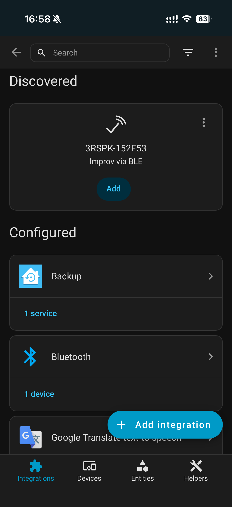
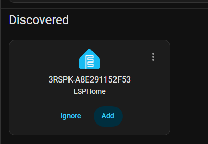
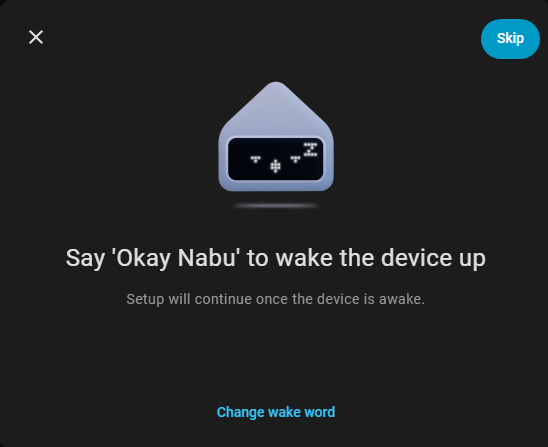
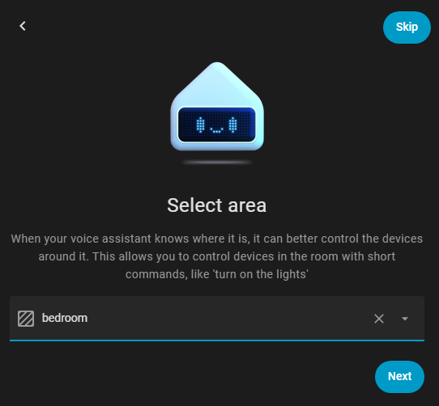
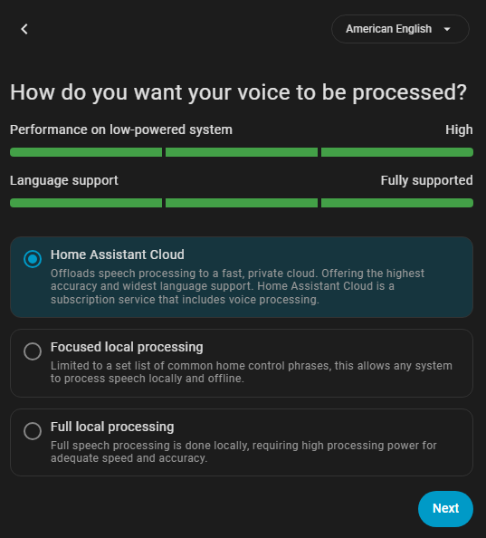

# Voice&Music Assistant
<div align="center">
  
</div>

ThirdReality Voice&Music Assistant is an open-source speaker that supports connecting to the Home Assistant Voice Assistant and Music Assistant. You need to have a device running Home Assistant in order to use this speaker. If you do not have Home Assistant installed yet, refer to the [installation documentation](https://www.home-assistant.io/installation/) for instructions.

[Buy it on ThirdReality Shop](https://thirdreality.com/product/voice-music-assistant-dev-edition/)

- [Voice\&Music Assistant](#voicemusic-assistant)
  - [How to build](#how-to-build)
  - [How to flash](#how-to-flash)
  - [How to connect wifi](#how-to-connect-wifi)
  - [Voice Assistant](#voice-assistant)
  - [Music Assistant](#music-assistant)

## How to build

Requires:
  - Ubuntu 20.04

Install dependencies:
```
sudo apt-get update

sudo apt-get install -y build-essential bash bc binutils build-essential bzip2 cpio g++ gcc git gzip locales libncurses5-dev libdevmapper-dev libsystemd-dev make mercurial whois patch perl python rsync sed tar vim unzip wget bison flex libssl-dev libc6:i386 libncurses5:i386 libstdc++6:i386 zlib1g-dev:i386 zip python3-pip pkg-config automake gsettings-ubuntu-schemas libglib2.0-dev gcc-multilib g++-multilib

pip install pycrypto

wget http://ftp.cn.debian.org/debian/pool/main/a/automake-1.16/automake_1.16.1-4_all.deb && sudo dpkg -i automake_1.16.1-4_all.deb && rm -f automake_1.16.1-4_all.deb
```

Clone the repository:
```
git clone https://github.com/thirdreality/voice-music-assistant.git
cd <YOUR PATH>/voice-music-assistant
git submodule update --init
```

Build:
```
./go trspk <version>               // If no version number is specified, the date will be used
```

The generated image is located at:
```
<YOUR PATH>/voice-music-assistant/image
```

## How to flash
1. Download and extract [Aml_Burn_Tool.zip](https://raw.githubusercontent.com/thirdreality/voice-music-assistant/master/tools/Aml_Burn_Tool.zip)

2. If this is your first time using the tool, click on Setup_Aml_Burn_Tool_V3.1.0.exe to install necessary drivers.

3. Next, navigate to the v2 folder and run Aml_Burn_Tool.exe.

4. Load the compiled **.img firmware file. Or you can download the latest firmware [here](https://github.com/thirdreality/voice-music-assistant/releases).

5. Click on Start to initiate the burn process.

<div align="left">
  
</div>

6. Use debug board to connect the speaker to the PC. Make sure to use a data cable. Then power it on.

<div align="left">
  
</div>

## How to connect wifi
1. You need to install the iOS or Android version of the [Home Assistant app](https://companion.home-assistant.io/) first.
2. Make sure the speaker is in a yellow blinking state.Otherwise, please try factory reset. (Press and hold the Home button for 15 seconds, then release it after you hear the prompt sound.)
3. Open the Home Assistant app on your phone.Go to Settings -> Devices & services and under Discovered, you should see the device as "3RSPK-XXXXX Improv via BLE".
4. Enter your Wi-Fi SSID and password. Only 2.4 GHz networks are supported.
5. A few seconds after the Wi-Fi connection is successful, the speaker will play “Your device is ready to connect to Home Assistant.” At that point, you can proceed to the next step.
<div align="left">
  
</div>

## Voice Assistant
1. There are two ways to use the voice assistant (If your device doesn’t have sufficient performance, please choose Home Assistant Cloud.):

    - Choose Home Assistant Cloud. For more information, refer to the guide on [Getting started with Home Assistant Cloud](https://www.home-assistant.io/voice_control/voice_remote_cloud_assistant/)

    - Run Whisper, Piper on your local device. [Install whisper piper](./doc/install_piper_whisper.md)

2. After completing either of the above options, add an assistant under Settings → Voice Assistants.
<div align="left">
  
</div>

3. Go to Settings -> Devices & services and under Discovered, you should see the device as "3RSPK-XXXXXXXXXXXX ESPHome", click Add.

<p>
  
  
  
  
</p>


Once completed, you can use “OK Nabu” to wake the speaker and start a conversation.

## Music Assistant
1. Add Music Assistant under Settings → Add-ons. [Getting started with Music Assistant](https://www.home-assistant.io/integrations/music_assistant/)
<div align="left">
  
</div>

2. In Music Assistant → Settings → Add Player Provider, select Snapcast and use the default configuration.

3. In Music Assistant → Settings → Add Music Provider. [Music Providers Guide](https://www.music-assistant.io/music-providers/)

4. Once completed, you can start playing music.
<div align="left">
  
</div>
