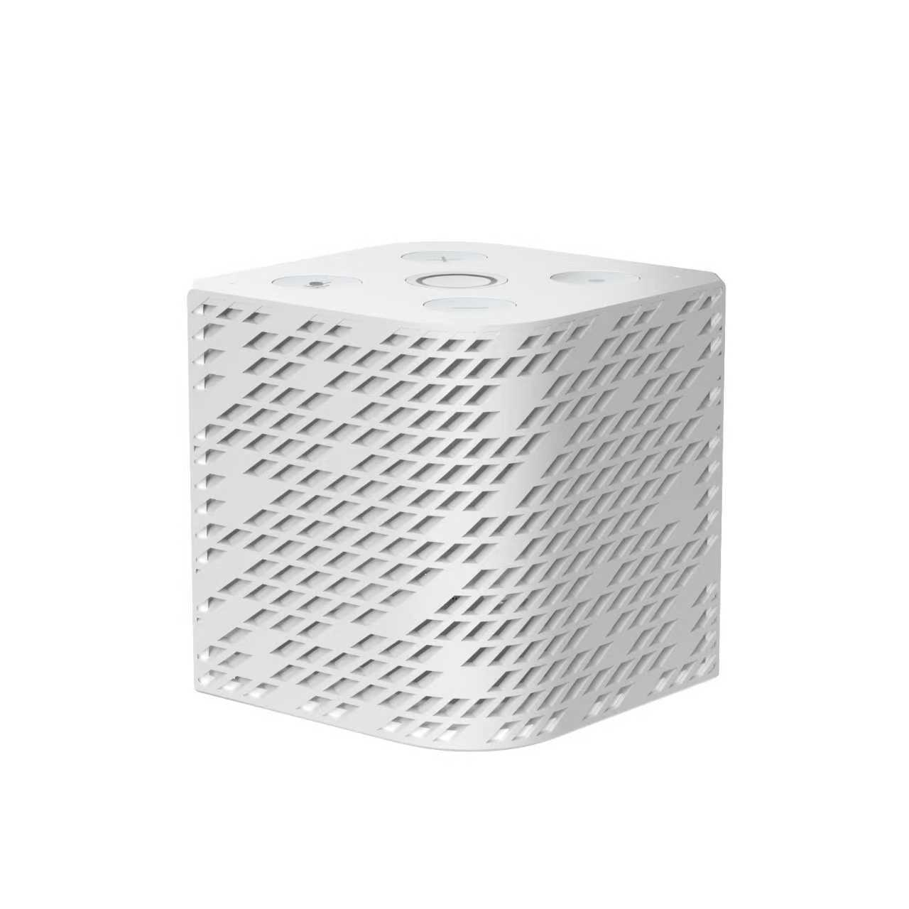
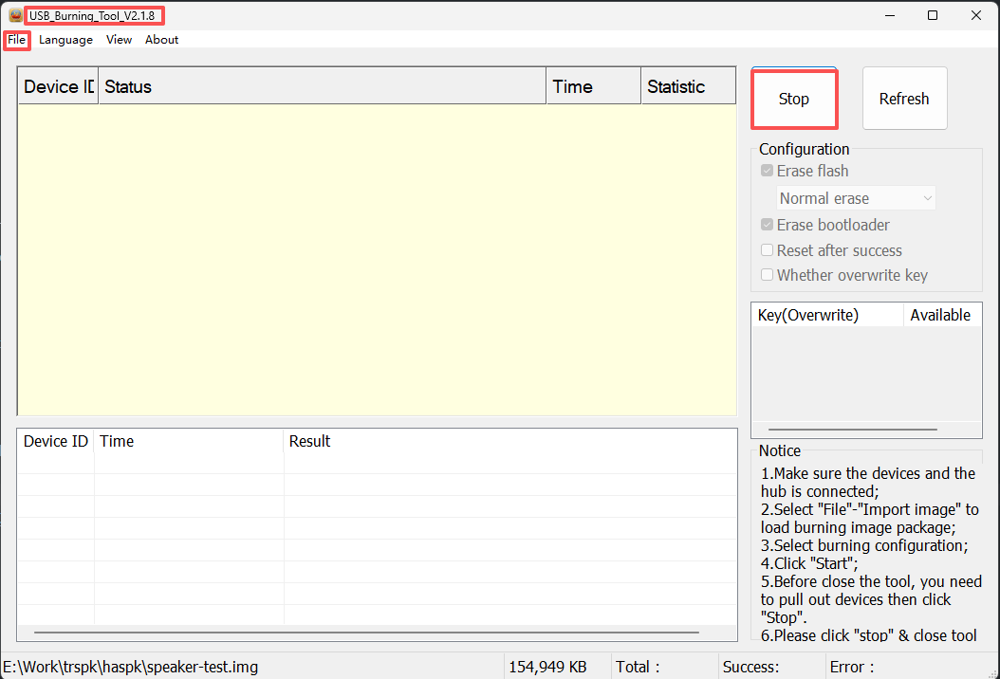
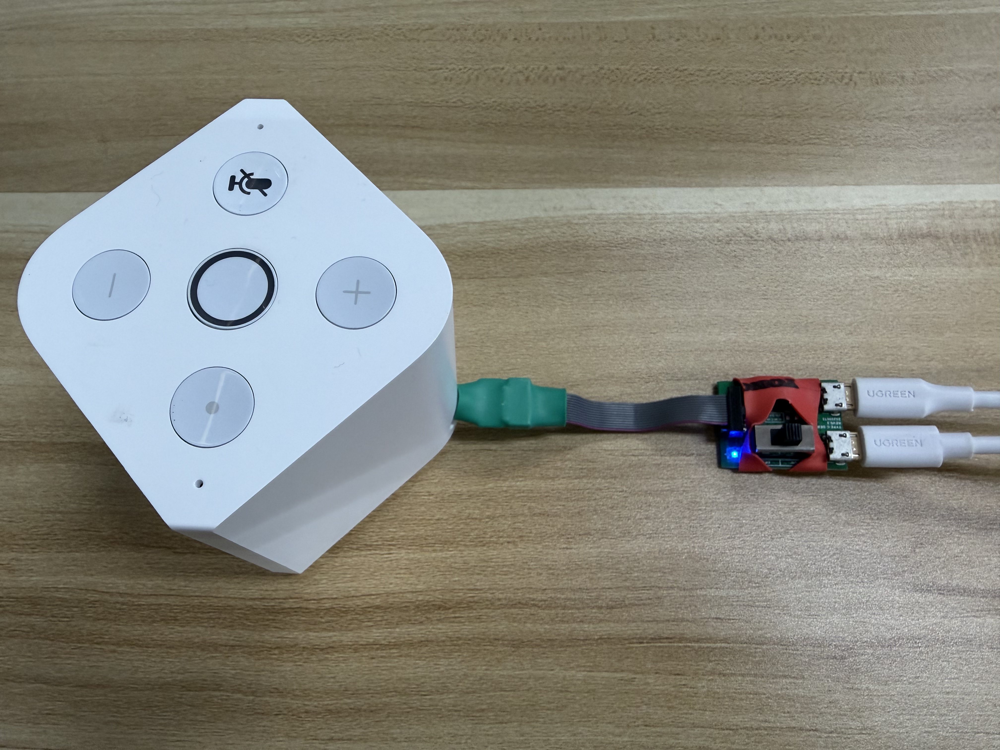
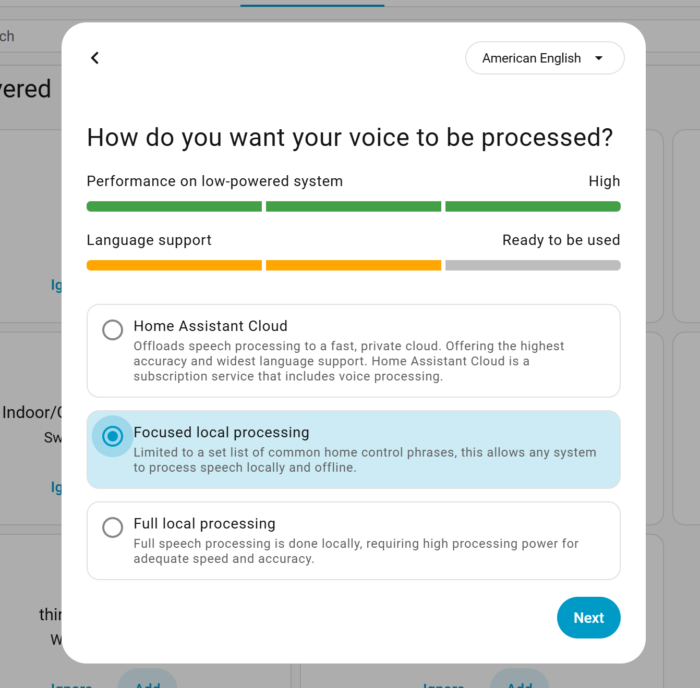
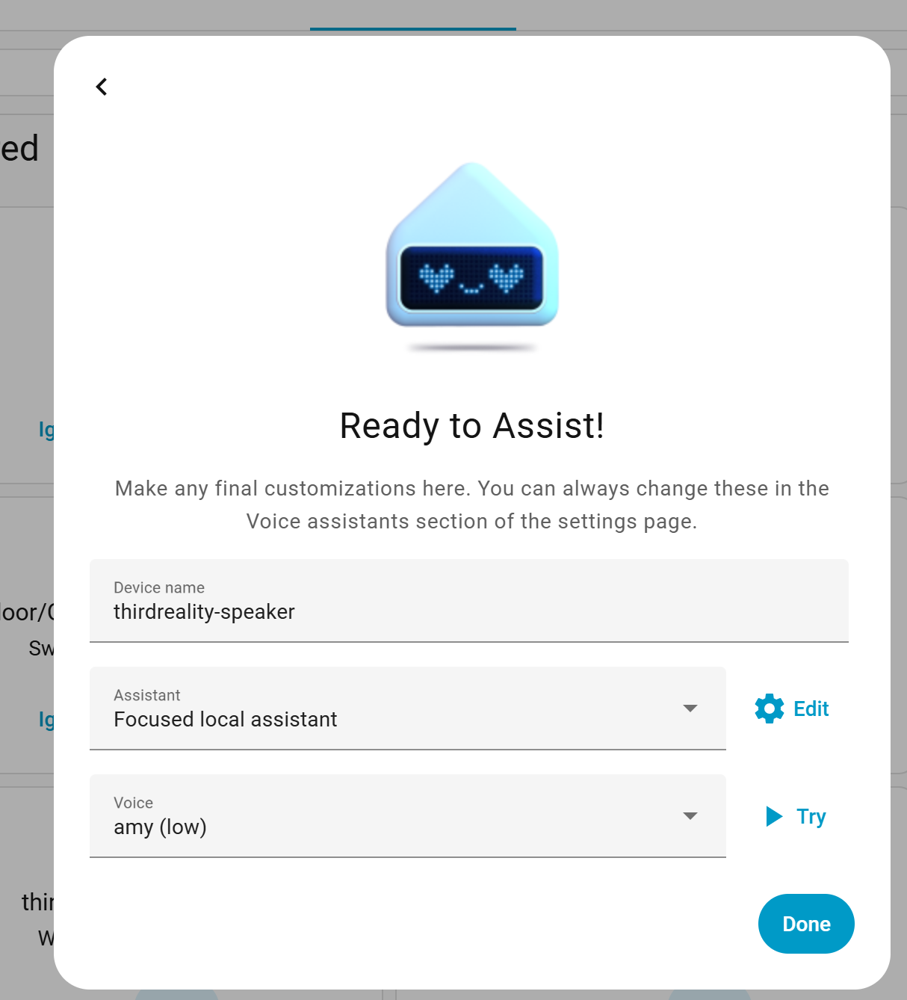
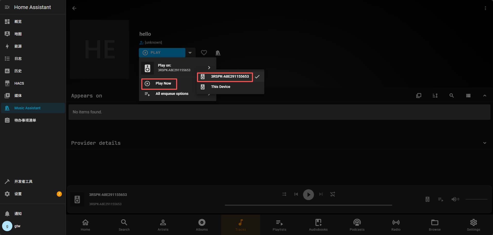

# HA Speaker
<div align="center">
  
</div>

ThirdReality HA Speaker is an open-source speaker that supports connecting to the Home Assistant Voice Assistant and Music Assistant. You need to have a device running Home Assistant in order to use this speaker.

- [How to build](#how-to-build)
- [How to flash](#how-to-flash)
- [How to pair](#how-to-pair)
- [Voice assistant](#voice-assistant)
- [Music assistant](#music-assistant)

## How to build

Requires:
  - Ubuntu 20.04

Install dependencies:
```
sudo apt-get update

sudo apt-get install -y build-essential bash bc binutils build-essential bzip2 cpio g++ gcc git gzip locales libncurses5-dev libdevmapper-dev libsystemd-dev make mercurial whois patch perl python rsync sed tar vim unzip wget bison flex libssl-dev libc6:i386 libncurses5:i386 libstdc++6:i386 zlib1g-dev:i386 zip python3-pip pkg-config automake gsettings-ubuntu-schemas libglib2.0-dev gcc-multilib g++-multilib

pip install pycrypto

wget http://ftp.cn.debian.org/debian/pool/main/a/automake-1.16/automake_1.16.1-4_all.deb && sudo dpkg -i automake_1.16.1-4_all.deb && rm -f automake_1.16.1-4_all.deb
```

Clone the repository:
```
git clone https://github.com/thirdreality/ha-speaker.git
cd <YOUR PATH>/ha-speaker
git submodule update --init
```

Build:
```
./go trspk
```

The generated image is located at:
```
<YOUR PATH>/ha-speaker/image
```

## How to flash
1. Download and extract [Aml_Burn_Tool.zip](https://raw.githubusercontent.com/thirdreality/ha-speaker/master/tools/Aml_Burn_Tool.zip)

2. If this is your first time using the tool, click on Setup_Aml_Burn_Tool_V3.1.0.exe to install necessary drivers.

3. Next, navigate to the v2 folder and run Aml_Burn_Tool.exe.

4. Load the compiled **.img firmware file

5. Click on Start to initiate the burn process.

<div align="left">
  
</div>

6. Use debug board to connect the speaker to the PC. Make sure to use a data cable. Then power it on.

<div align="left">
  
</div>

## How to pair
Download the 3R-Installer app from the app store, then select Add Speaker to set up the network.(Only 2.4 GHz Wi-Fi is supported)

## Voice Assistant
1. There are two ways to use the voice assistant:

    - Choose Home Assistant Cloud. For more information, refer to the guide on [Getting started with Home Assistant Cloud](https://www.home-assistant.io/voice_control/voice_remote_cloud_assistant/)

    - Run Whisper, Piper on your local device. [Install whisper piper](./doc/install_piper_whisper.md)

2. After completing either of the above options, dd an assistant under Settings → Voice Assistants.

3. Add the Wyoming Protocol integration in Home Assistant.Set the Host to the speaker’s IP address (which can be found in the 3R-Installer app), and set the port to 10700

Please select the appropriate option here based on the choice you made in step 1.
<div align="left">
  
</div>

Please select the assistant you created in step 2.
<div align="left">
  
</div>

Once completed, you can use “OK Nabu” to wake the speaker and start a conversation.

## Music Assistant
1. Add Music Assistant under Settings → Add-ons. [Getting started with Music Assistant](https://www.home-assistant.io/integrations/music_assistant/)

2. In Music Assistant → Settings → Add Player Provider, select Snapcast and use the default configuration.

3. In Music Assistant → Settings → Add Music Provider. [Music Providers Guide](https://www.music-assistant.io/music-providers/)

4. Once completed, you can start playing music.
<div align="left">
  
</div>
